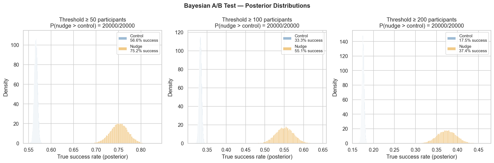
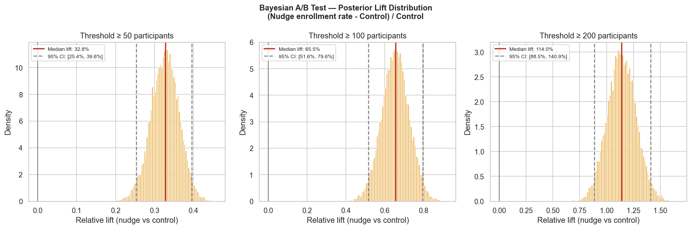
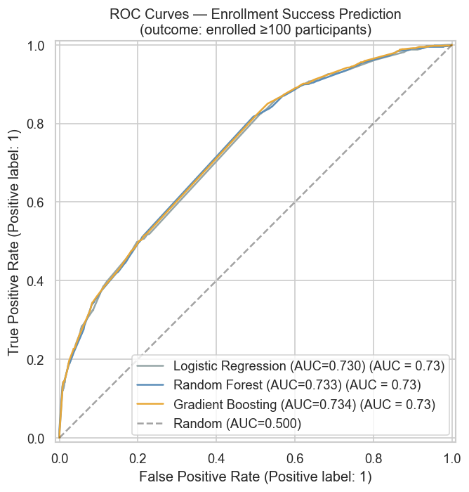
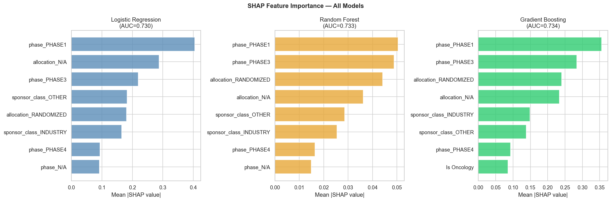
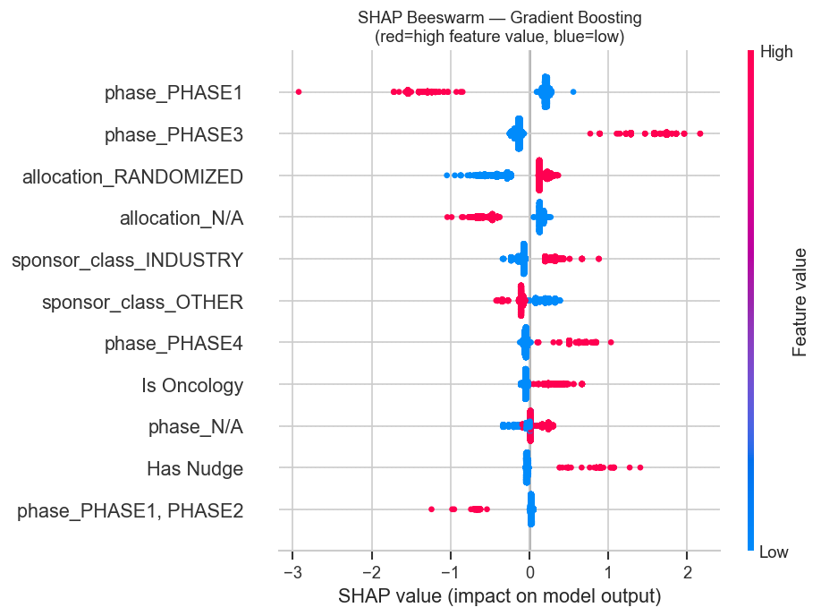

# Do Behavioral Nudges Increase Clinical Trial Enrollment?
### A/B Testing with Bayesian Analysis on Real-World ClinicalTrials.gov Data

Rigorous A/B testing framework applied to 18,644 completed clinical trials, 
investigating whether behavioral nudge interventions — reminders, outreach, 
navigators, incentives — increase patient enrollment rates compared to standard 
recruitment approaches.

Combines frequentist and Bayesian methods to answer a question with direct 
implications for clinical research efficiency: **can a simple nudge meaningfully 
move the needle on trial enrollment?**

## Research Question

80% of clinical trials fail to meet enrollment targets on time, causing delays, 
cost overruns, and in some cases trial termination. Behavioral nudges — low-cost 
interventions drawn from behavioral economics — have shown promise in other 
healthcare contexts. This project tests their impact on enrollment at scale 
using observational data from ClinicalTrials.gov.

## Dataset

**Source:** [ClinicalTrials.gov API v2](https://clinicaltrials.gov/data-api/api)  
**Trials:** 18,457 completed interventional trials (after removing top 1% enrollment outliers)  
**Treatment:** Trials with behavioral nudge interventions (n=468)  
**Control:** Standard recruitment trials (n=17,989)  
No PHI involved — all data publicly available.

## Analyses

### Notebook 1 — EDA & Power Analysis ✅


- Enrollment distributions reveal nudge trials enroll ~2x more (median 119 vs 60)
- Federal sponsors use nudge strategies at 3x the overall rate
- Power analysis: MDE = d=0.131 — well below our observed effect of d=0.489

### Notebook 2 — Frequentist A/B Test ✅


- Mann-Whitney U: p=2.29e-30, rank-biserial r=0.308
- Nudge trials enroll **2x more participants** (geometric mean 131 vs 65)
- Effect robust across oncology, non-oncology, and randomized trials
- Bonferroni correction applied across 8 subgroups — 6 survive
- Industry and federal sponsors underpowered (n=15 nudge trials each)

### Notebook 3 — Bayesian A/B Test ✅




- Beta-Binomial conjugate model with uniform prior Beta(1,1)
- Posterior distributions completely separated — P(nudge > control) = 20000/20000 samples
- Median lift: **+33%** at threshold ≥50, **+66%** at ≥100, **+114%** at ≥200 participants
- 95% credible intervals entirely above zero across all thresholds
- Effect grows larger for more ambitious enrollment targets

### Notebook 4 — Predictive Modeling ✅





- Binary outcome: did the trial enroll ≥100 participants? (33.8% success rate)
- All models use OneHotEncoding — LabelEncoding artificially penalized Logistic Regression (AUC 0.677 → 0.730 with correct encoding)
- Three models nearly identical after correct encoding: LR=0.730, RF=0.733, GBM=0.734
- Relationship between trial design features and enrollment is largely linear
- **`Has Nudge` ranks 10/21** across all models — positive direction but modest unique contribution after controlling for phase, sponsor, and allocation
- Top predictors: trial phase (Phase 3 ✅, Phase 1 ❌), randomization, sponsor class

**The key insight:** The 2x enrollment advantage of nudge trials (Notebooks 2-3) 
is largely mediated by confounding trial design features — nudge trials tend to 
be Phase 3, randomized, and academically sponsored. This is a classic 
observational data challenge: association ≠ causation.

## Stack

- **Python, pandas** — data ingestion and processing
- **scipy** — frequentist hypothesis testing + Bayesian Beta-Binomial model
- **statsmodels** — multiple testing correction
- **scikit-learn, SHAP** — predictive modeling
- **Matplotlib, seaborn, plotly** — visualizations
- **JupyterLab** — documented analysis notebooks

## Project Structure
```
clinical-trial-nudges/
├── data/
│   ├── raw/          # ClinicalTrials.gov JSON (not tracked in git)
│   └── processed/    # cleaned dataset (not tracked in git)
├── notebooks/
│   ├── 01_eda.ipynb
│   ├── 02_frequentist.ipynb
│   ├── 03_bayesian.ipynb
│   └── 04_predictive.ipynb
├── figures/          # saved plots
├── src/
│   └── ingest.py     # data ingestion pipeline
├── requirements.txt
├── .gitignore
└── README.md
```
## Setup

```bash
git clone https://github.com/KelyNorel/clinical-trial-nudges.git
cd clinical-trial-nudges
pyenv virtualenv 3.11 trial-nudges
pyenv local trial-nudges
pip install -r requirements.txt
python src/ingest.py
```

---

**Author:** Raquel (Kely) Norel, PhD  
**Domain:** Clinical Research / Behavioral Economics / A/B Testing 
**Companion project:** [beats-and-focus](https://github.com/KelyNorel/beats-and-focus) — same methods, more fun 
**Status:** ✅ Complete — all 4 notebooks finished

