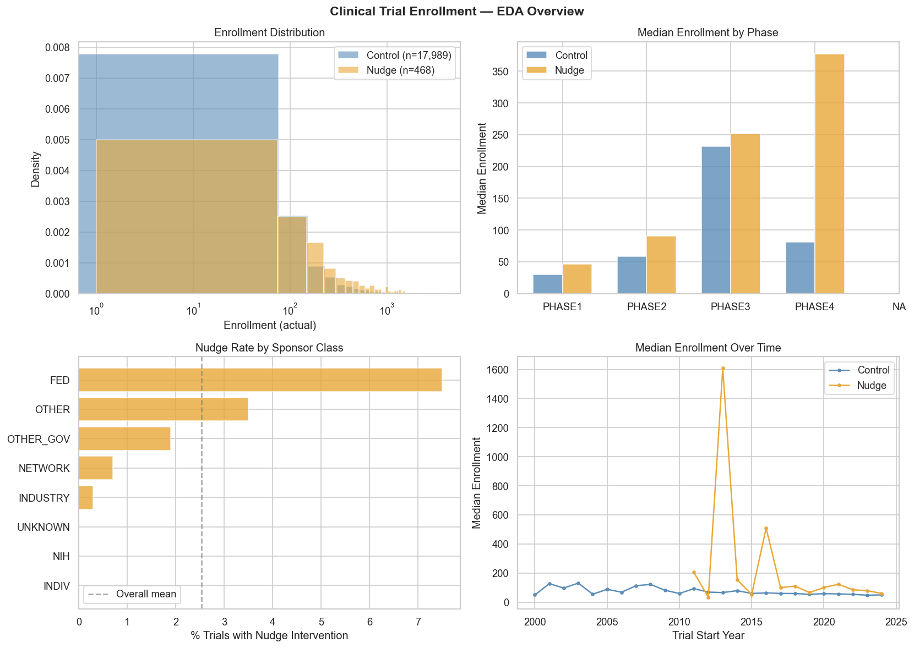
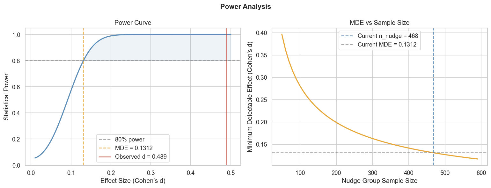
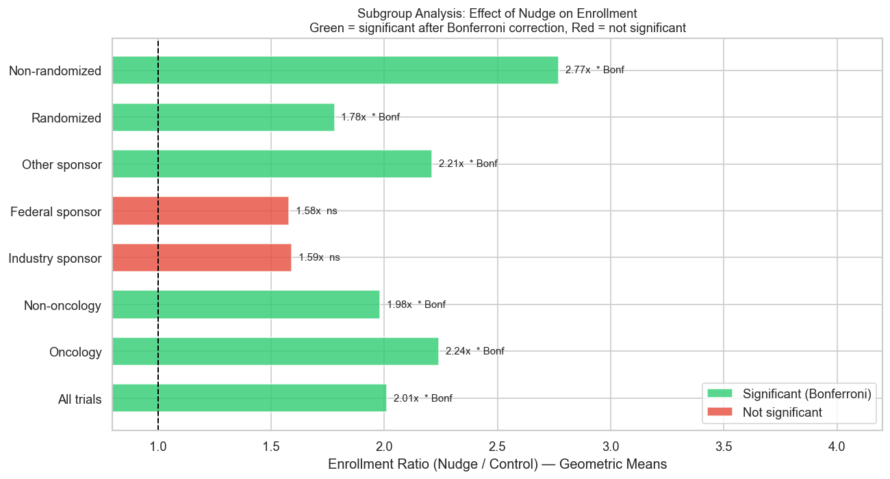

# Do Behavioral Nudges Increase Clinical Trial Enrollment?
### A/B Testing with Bayesian Analysis on Real-World ClinicalTrials.gov Data

Rigorous A/B testing framework applied to 18,644 completed clinical trials, 
investigating whether behavioral nudge interventions — reminders, outreach, 
navigators, incentives — increase patient enrollment rates compared to standard 
recruitment approaches.

Combines frequentist and Bayesian methods to answer a question with direct 
implications for clinical research efficiency: **can a simple nudge meaningfully 
move the needle on trial enrollment?**

## Research Question

80% of clinical trials fail to meet enrollment targets on time, causing delays, 
cost overruns, and in some cases trial termination. Behavioral nudges — low-cost 
interventions drawn from behavioral economics — have shown promise in other 
healthcare contexts. This project tests their impact on enrollment at scale 
using observational data from ClinicalTrials.gov.

## Dataset

**Source:** [ClinicalTrials.gov API v2](https://clinicaltrials.gov/data-api/api)  
**Trials:** 18,644 completed interventional trials with actual enrollment data  
**Treatment:** Trials with behavioral nudge interventions (n=494)  
**Control:** Standard recruitment trials (n=18,150)  
No PHI involved — all data publicly available.

## Analyses

### Notebook 1 — EDA & Power Analysis ✅




- Enrollment distributions reveal nudge trials enroll ~2x more (median 119 vs 60)
- Federal sponsors use nudge strategies at 3x the overall rate
- Power analysis: MDE = d=0.131 — well below our observed effect of d=0.489

### Notebook 2 — Frequentist A/B Test ✅



- Mann-Whitney U: p=2.29e-30, rank-biserial r=0.308
- Nudge trials enroll **2x more participants** (geometric mean 131 vs 65)
- Effect robust across oncology, non-oncology, and randomized trials
- Bonferroni correction applied across 8 subgroups — 6 survive
- Industry and federal sponsors underpowered (n=15 nudge trials each)

### Notebook 3 — Bayesian A/B Test (`notebooks/03_bayesian.ipynb`) 🔄
- Beta-Binomial conjugate model
- Posterior distributions and credible intervals
- Probability that nudge > control
- Comparison of frequentist vs Bayesian conclusions

### Notebook 4 — Predictive Modeling (`notebooks/04_predictive.ipynb`) 🔄
- What trial features predict meeting enrollment goals?
- Gradient boosting + SHAP feature importance
- Enrollment goal achievement as binary outcome

## Stack

- **Python, pandas** — data ingestion and processing
- **scipy, statsmodels** — frequentist hypothesis testing
- **PyMC, ArviZ** — Bayesian modeling
- **scikit-learn, SHAP** — predictive modeling
- **Matplotlib, seaborn, plotly** — visualizations
- **JupyterLab** — documented analysis notebooks

## Project Structure
```
clinical-trial-nudges/
├── data/
│   ├── raw/          # ClinicalTrials.gov JSON (not tracked in git)
│   └── processed/    # cleaned dataset (not tracked in git)
├── notebooks/
│   ├── 01_eda.ipynb
│   ├── 02_frequentist.ipynb
│   ├── 03_bayesian.ipynb
│   └── 04_predictive.ipynb
├── figures/          # saved plots
├── src/
│   └── ingest.py     # data ingestion pipeline
├── requirements.txt
├── .gitignore
└── README.md
```
## Setup

```bash
git clone https://github.com/KelyNorel/clinical-trial-nudges.git
cd clinical-trial-nudges
pyenv virtualenv 3.11 trial-nudges
pyenv local trial-nudges
pip install -r requirements.txt
python src/ingest.py
```

---

**Author:** Raquel (Kely) Norel, PhD  
**Domain:** Clinical Research / Behavioral Economics / A/B Testing  
**Status:** 🔄 In progress — Notebooks 1 and 2 complete

